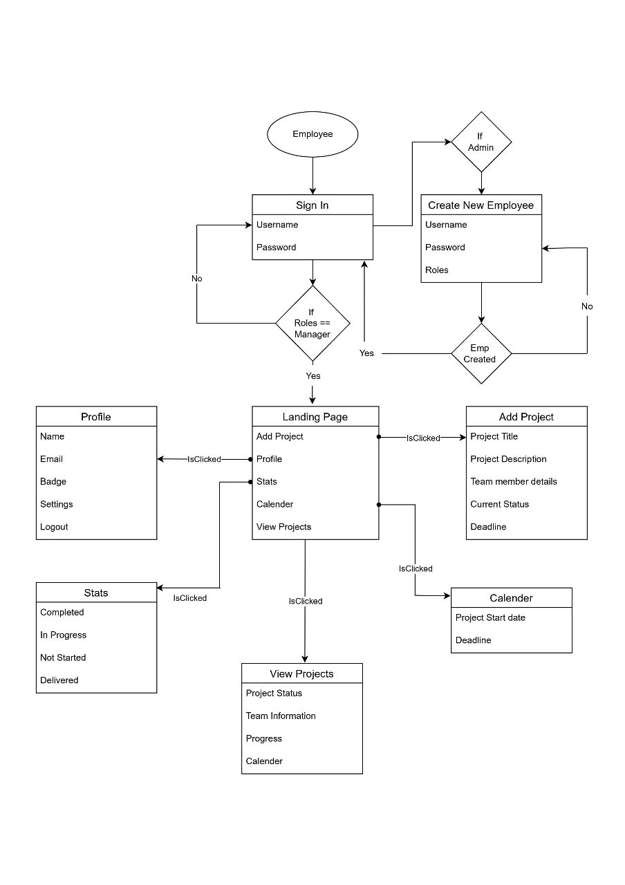
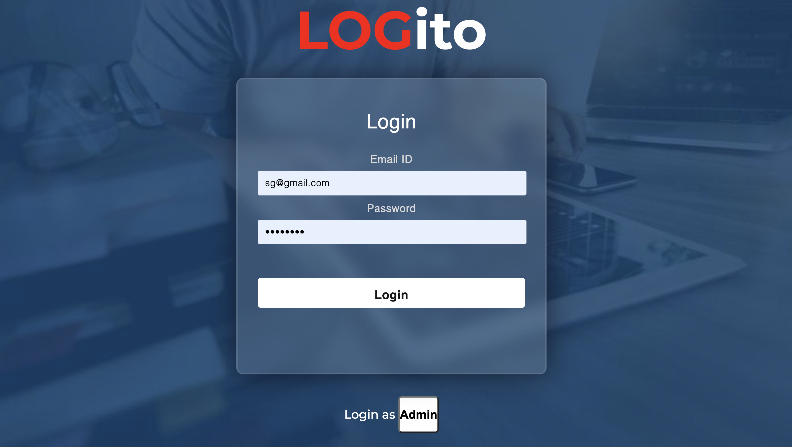
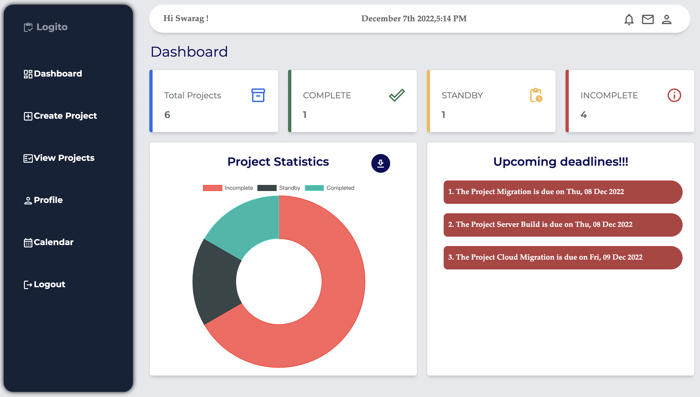
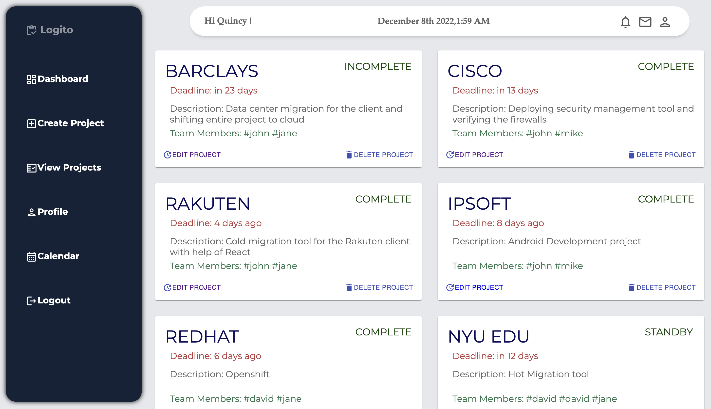
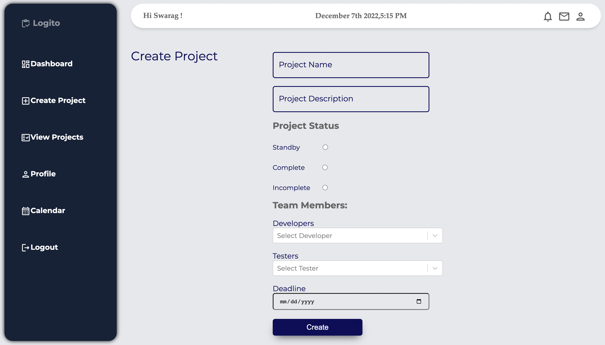
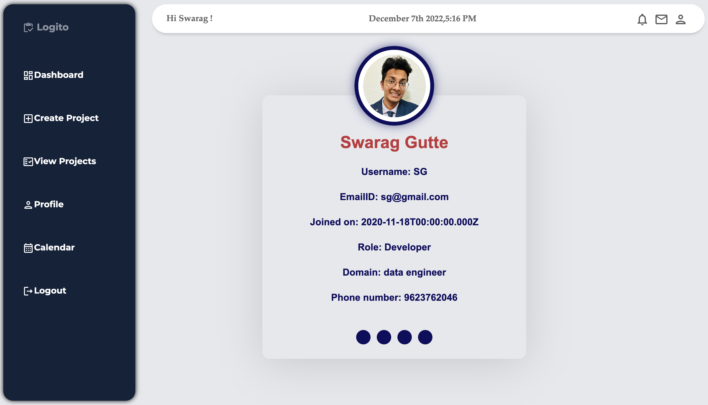
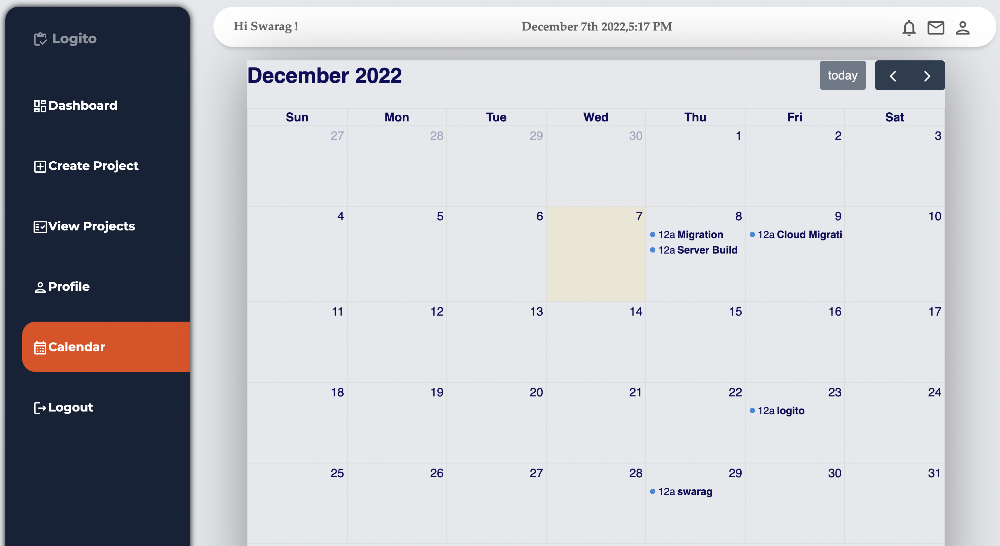

# Logito

Logito is an application that can be used by project managers to keep track of all projects under him. It offers
functionalities such as adding projects and delegating tasks to the employees, viewing the projects, updating and
deleting them. It also offers the feature of viewing statistics about projects in their various completion stages.

## Roles

* System Admin
* Project Manager

## User Requirements/Flow

### System Admin

* System Admin can log in using system admin credentials.
* System Admin can add a new employee to the database giving him access to the system.
* System Admin sends an email to the newly added employee with his/her credentials.

### Project Manager

* Project Manager can login to the system using his credentials received on email.
* Project Manager can Add projects and project details such as the project name, description, deadline and add team
  members to the project and assign roles to the team members.
* PM can view all the projects added and can also filter out the projects based on status of the project or date of
  completion.
* PM can edit the project details such as the status, team members, description, etc.
* PM can delete the project as well.
* PM can also view the statistics of all projects i.e. graphs of how many projects are left pending, how many are in
  progress, how many have been completed but yet to be delivered and how many have been handed over to the client.
* A calendar functionality would also be present to help PM keep track of all the Project deadlines and when the project
  is scheduled for delivery.
 
## Domain Model 

## Additional description about the project and its features.

<h2> Login: </h2>

<h2> Dashboard: </h2>

<h2> View Projects: </h2>

<h2> Create Projects: </h2>

<h2> View Profile: </h2>

<h2> Calendar: </h2>

## Steps to run the project:
1. Server:
* cd server
* run npm i
* run npm start

2. Client:
* cd  client/logito
* run npm i
* run npm start
